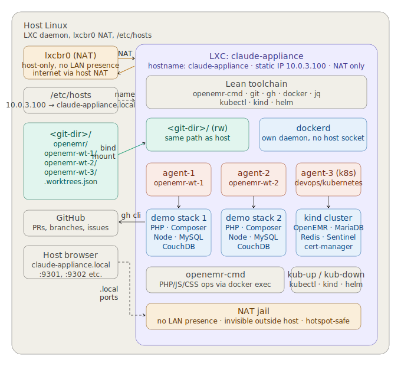

# Claude Code Multi-Agent LXC Appliance Setup

## Architecture



---

## Overview

A jailed Ubuntu LXC container running on the host Linux machine, connected to the host's git directory via bind mount (mirrored path). The container uses LXC's default NAT networking — no bridge required — with a static IP inside the container and a single `/etc/hosts` entry on the host for name resolution.

**Key design decisions:**
- PHP, Composer, and Node are **not** installed in the LXC — all dev tooling runs inside the demo stacks via `openemr-cmd` commands (`docker exec`)
- LXC provides the jail — agents cannot reach host Docker, host filesystem, or host localhost services
- **NAT networking** (not bridged) — the container has no LAN presence, cannot reach your router or other LAN devices, and is invisible to everything outside the host
- Static IP inside the container + `/etc/hosts` on the host gives a stable `claude-appliance.local` name — no mDNS or Avahi needed
- Works on any connection including mobile hotspot — no dependency on LAN or router config
- `openemr-cmd` handles all worktree lifecycle, port offset management, and Docker stack orchestration

**Containment stack:**
- **LXC** — jails the filesystem, processes, and kernel namespaces
- **NAT networking** — jails the network; container traffic exits only via host NAT
- **No PHP/Composer/Node on appliance** — no dev tooling to exploit
- **`claude-agent` user with limited sudo** — minimal privilege inside the container
- **Bind-mounted git directory** — the only intentional read-write bridge to the host

---

## Step 1 — Configure ufw to allow LXC bridge forwarding

LXC container networking requires packet forwarding through the `lxcbr0` bridge. By default ufw blocks this. Two changes needed on the host:

```bash
# Allow traffic in and out on the lxcbr0 bridge
sudo ufw allow in on lxcbr0
sudo ufw allow out on lxcbr0

# Allow forwarding (ufw blocks it by default)
sudo nano /etc/default/ufw
# Change: DEFAULT_FORWARD_POLICY="DROP"
# To:     DEFAULT_FORWARD_POLICY="ACCEPT"

sudo ufw reload
```

> **Security note:** `DEFAULT_FORWARD_POLICY="ACCEPT"` allows packets to be forwarded between network interfaces. This is required for NAT-based container networking. It does not open any new ports to the internet or weaken your existing ufw rules — your inbound/outbound rules all remain in effect. On a typical home or dev machine this is a negligible change.

---

## Step 2 — Install LXC on the host

```bash
sudo apt update
sudo apt install lxc lxc-utils lxc-templates
```

---

## Step 3 — Create the Ubuntu 24.04 container

```bash
sudo lxc-create -n claude-appliance -t download -- \
  --dist ubuntu --release noble --arch amd64
```

---

## Step 4 — Configure the container

`lxc-create` already generates `/var/lib/lxc/claude-appliance/config` with the hostname, architecture, rootfs path, and NAT networking (including a real MAC address). You only need to **append** three blocks to the end of that existing file:

```bash
sudo tee -a /var/lib/lxc/claude-appliance/config << 'EOF'
# Allow nested Docker
lxc.apparmor.profile = unconfined
lxc.cap.drop =
lxc.cgroup2.devices.allow = a
# Git directory bind mount (mirror host path exactly)
lxc.mount.entry = /home/brady2/git home/brady2/git none bind,create=dir 0 0
EOF
```

> Replace `/home/brady2/git` with your actual git directory path if different. The target (second path) must be the same path without the leading `/`.

Verify the final config looks correct:

```bash
cat /var/lib/lxc/claude-appliance/config
```

---

## Step 5 — Start and enter the container

```bash
sudo lxc-start -n claude-appliance
sudo lxc-attach -n claude-appliance
```

---

## Step 6 — Create the agent user

Ubuntu 24.04 creates a default `ubuntu` user at UID 1000 during container setup. Rename it to `claude-agent` and match your host UID so bind-mounted files have correct ownership.

First check your host UID:

```bash
# On the host
id <your-username>
# e.g. uid=1000(brady2) ...
```

Then inside the container:

```bash
# Rename ubuntu → claude-agent
usermod -l claude-agent ubuntu
usermod -d /home/claude-agent -m claude-agent
groupmod -n claude-agent ubuntu

# If your host UID is not 1000, adjust to match
# (skip these three lines if host UID is already 1000)
usermod -u <host-uid> claude-agent
groupmod -g <host-uid> claude-agent
chown -R claude-agent:claude-agent /home/claude-agent

# Always run this — grants passwordless sudo for apt-get and systemctl
echo "claude-agent ALL=(ALL) NOPASSWD: /usr/bin/apt-get, /usr/bin/systemctl" \
  >> /etc/sudoers.d/claude-agent

# Verify UID matches host
id claude-agent
```

---

## Step 7 — Install lean toolchain

> 🖥️ **Inside container** (as root)

```bash
apt update && apt install -y \
  git curl wget gnupg ca-certificates jq

# Set hostname
hostnamectl set-hostname claude-appliance

# GitHub CLI
curl -fsSL https://cli.github.com/packages/githubcli-archive-keyring.gpg \
  | dd of=/usr/share/keyrings/githubcli-archive-keyring.gpg
echo "deb [signed-by=/usr/share/keyrings/githubcli-archive-keyring.gpg] \
  https://cli.github.com/packages stable main" \
  > /etc/apt/sources.list.d/github-cli.list
apt update && apt install -y gh

# Docker (full daemon — LXC handles the jail)
curl -fsSL https://get.docker.com | sh
systemctl enable docker
systemctl start docker

# kubectl
curl -fsSL https://dl.k8s.io/release/$(curl -fsSL https://dl.k8s.io/release/stable.txt)/bin/linux/amd64/kubectl \
  -o /usr/local/bin/kubectl
chmod +x /usr/local/bin/kubectl

# kind (Kubernetes IN Docker — for openemr-devops kubernetes work)
curl -fsSL https://kind.sigs.k8s.io/dl/latest/kind-linux-amd64 \
  -o /usr/local/bin/kind
chmod +x /usr/local/bin/kind

# helm (used by kub-up to install cert-manager and NFS provisioner)
curl -fsSL https://raw.githubusercontent.com/helm/helm/main/scripts/get-helm-3 | bash

# openemr-cmd (available via bind-mounted git dir)
cp <git-dir>/openemr-devops/utilities/openemr-cmd/openemr-cmd /usr/local/bin/openemr-cmd
chmod +x /usr/local/bin/openemr-cmd

# Add claude-agent to docker group
usermod -aG docker claude-agent

# Node.js and Claude Code
curl -fsSL https://deb.nodesource.com/setup_lts.x | bash -
apt install -y nodejs
npm install -g @anthropic-ai/claude-code

# No PHP, Composer, or Avahi — not needed
```

---

## Step 8 — Set a static IP inside the container

> 🖥️ **Inside container** (as root)

Find the current DHCP-assigned IP and gateway:

```bash
ip addr show eth0     # note the current 10.0.3.x address
ip route show default # note the gateway e.g. 10.0.3.1
```

Pick a static address in the same range that won't conflict with other containers (e.g. `10.0.3.100`). Write directly to systemd-networkd — `netplan apply` doesn't work in LXC because it requires `udevadm`:

```bash
cat > /etc/systemd/network/10-static.network << 'EOF'
[Match]
Name=eth0

[Network]
Address=10.0.3.100/24
Gateway=10.0.3.1
DNS=10.0.3.1
FallbackDNS=8.8.8.8 1.1.1.1

[Route]
Gateway=10.0.3.1
EOF

systemctl restart systemd-networkd
sleep 5
```

Verify:

```bash
ip addr show eth0
# Should show 10.0.3.100 as a static address
ping -c 2 10.0.3.1
ping -c 2 8.8.8.8
ping -c 2 archive.ubuntu.com
```

---

## Step 9 — Add name resolution on the host

> 💻 **On the host machine**

```bash
sudo nano /etc/hosts
```

Add:

```
10.0.3.100   claude-appliance.local
```

Verify from the host:

```bash
ping claude-appliance.local
# Should get replies from 10.0.3.100
```

---

## Step 10 — Authenticate GitHub CLI

> 🖥️ **Inside container** (as claude-agent)

Use a **fine-grained personal access token** scoped to the minimum permissions needed. Create one at:

```
GitHub → Settings → Developer settings →
Personal access tokens → Fine-grained tokens → Generate new token
```

Select only the repos agents will work on (e.g. `openemr/openemr`, `openemr/openemr-devops`). Required permissions:

| Permission | Level |
|------------|-------|
| Metadata | Read (always required) |
| Pull requests | Read and write |
| Issues | Read and write |

> `Contents` is **not** needed — agents push branches via `git push` using the existing repo remote, not via the token. The token is only used by `gh` CLI for API operations (opening PRs, reading issues).

Set a 90-day expiration and rotate periodically. Then authenticate:

```bash
su - claude-agent
gh auth login
# Select: GitHub.com → HTTPS → Paste token
```

---

## Step 11 — Verify git path and worktree resolution

> 🖥️ **Inside container** (as claude-agent)

```bash
ls <git-dir>/
# Should see: openemr  openemr-wt-1  openemr-wt-2 ...

cd <git-dir>/openemr-wt-1
git status
# Should work — .git pointer resolves to <git-dir>/openemr/.git

openemr-cmd worktree list
# Shows all worktrees and status
```

---

## Step 12 — Verify demo stack and port access from host

> 🖥️ **Inside container** (as claude-agent)

```bash
cd <git-dir>/openemr

# Create test worktree and start stack
openemr-cmd worktree add test-appliance -b --env easy --start

# Check assigned ports
openemr-cmd worktree list

# Verify PHP tooling runs inside the stack, not the appliance
openemr-cmd pp
openemr-cmd ut
```

> 💻 **On the host** — open browser and visit:

```
https://claude-appliance.local:9301
```

Click through the SSL warning (self-signed cert — connection is still encrypted). You should see the OpenEMR setup/login screen.

> 🖥️ **Inside container** — clean up test worktree:

```bash
echo "y" | openemr-cmd worktree remove test-appliance
```

---

## Step 13 — Snapshot the baseline

> 💻 **On the host**

```bash
# Stop container cleanly first
sudo lxc-stop -n claude-appliance

# Take snapshot
sudo lxc-snapshot -n claude-appliance \
  -c "baseline — lean toolchain, docker, gh, openemr-cmd, static IP, host /etc/hosts verified"

# Confirm snapshot saved
sudo lxc-snapshot -n claude-appliance -L

# Restart
sudo lxc-start -n claude-appliance
```

To restore if something goes wrong later:

```bash
sudo lxc-stop -n claude-appliance
sudo lxc-snapshot -n claude-appliance -r snap0
sudo lxc-start -n claude-appliance
```

> **Note:** The bind-mounted `<git-dir>` is not included in snapshots — it lives on the host. Snapshots protect the appliance configuration only.

---

## Step 14 — Agent launch script

Save as `<git-dir>/launch-agent.sh`:

```bash
#!/bin/bash
# Usage: ./launch-agent.sh <branch-name> [--env easy|easy-light|easy-redis]

set -euo pipefail

BRANCH="${1:-}"
ENV="${2:---env easy}"
OPENEMR_ROOT="<git-dir>/openemr"

if [[ -z "${BRANCH}" ]]; then
  echo "Usage: launch-agent.sh <branch-name> [--env easy|easy-light|easy-redis]"
  exit 1
fi

export OPENEMR_ROOT

echo "==> Creating worktree and stack for: ${BRANCH}"
openemr-cmd worktree add "${BRANCH}" -b ${ENV} --start

SLUG=$(echo "${BRANCH}" | tr '/' '-' | tr -cd 'a-zA-Z0-9_-' | tr '[:upper:]' '[:lower:]')
WORKTREE_DIR="<git-dir>/openemr-wt-${SLUG}"

echo "==> Stack ports:"
openemr-cmd worktree list | grep "${BRANCH}"

echo "==> Launching Claude Code agent in ${WORKTREE_DIR}"
cd "${WORKTREE_DIR}"

claude --dangerously-skip-permissions
```

---

## Step 15 — Multi-agent orchestrator (optional)

Save as `<git-dir>/orchestrate.sh`:

```bash
#!/bin/bash
# Spawn agents for GitHub issues labelled 'ai-agent'
# Usage: ./orchestrate.sh [--max-agents 3] [--env easy]

set -euo pipefail

MAX_AGENTS="${MAX_AGENTS:-3}"
ENV="easy"
REPO="openemr/openemr"

while [[ $# -gt 0 ]]; do
  case $1 in
    --max-agents) MAX_AGENTS=$2; shift 2 ;;
    --env)        ENV=$2; shift 2 ;;
    *) echo "Unknown arg: $1"; exit 1 ;;
  esac
done

echo "==> Fetching open issues labelled 'ai-agent' from ${REPO}"
ISSUES=$(gh issue list \
  --repo "${REPO}" \
  --state open \
  --label "ai-agent" \
  --json number,title \
  --limit "${MAX_AGENTS}")

echo "${ISSUES}" | jq -r '.[] | "\(.number) \(.title)"' | while read -r NUM TITLE; do
  BRANCH="agent/issue-${NUM}"

  if openemr-cmd worktree list | grep -q "${BRANCH}"; then
    echo "==> Skipping issue #${NUM} — worktree already exists"
    continue
  fi

  echo "==> Spawning agent for issue #${NUM}: ${TITLE}"
  bash <git-dir>/launch-agent.sh "${BRANCH}" "--env ${ENV}" &

  # Stagger starts to avoid port collision during stack init
  sleep 5
done

wait
echo "==> All agents launched"
```

---

## Browser URL quick reference

| Service | Worktree 1 | Worktree 2 | Worktree 3 |
|---------|-----------|-----------|-----------|
| OpenEMR HTTPS | `https://claude-appliance.local:9301` | `:9302` | `:9303` |
| OpenEMR HTTP | `http://claude-appliance.local:8301` | `:8302` | `:8303` |
| phpMyAdmin | `http://claude-appliance.local:8311` | `:8312` | `:8313` |
| Mailpit | `http://claude-appliance.local:8026` | `:8027` | `:8028` |
| CouchDB | `http://claude-appliance.local:5985` | `:5986` | `:5987` |

> SSL warning on HTTPS is expected — the dev stack uses a self-signed cert. The connection is still encrypted. Click through once; Firefox lets you add a permanent exception.

---

## Notes

**Static IP collision avoidance:** `lxcbr0` typically uses `10.0.3.x`. If you run multiple LXC containers, assign each a distinct static IP (e.g. `10.0.3.100`, `10.0.3.101`). With a single `claude-appliance` container there is no conflict risk.

**Internet access:** The container reaches the internet via the host's NAT — works on any connection including mobile hotspot. No special networking on the host is required.

**If you ever want bridge + mDNS instead:** The switch is non-destructive. Configure `br0` on the host, update the LXC config to use `lxc.net.0.link = br0`, remove the static IP netplan config inside the container, and delete the `/etc/hosts` line. The NAT approach has no downsides for a single-developer setup.
